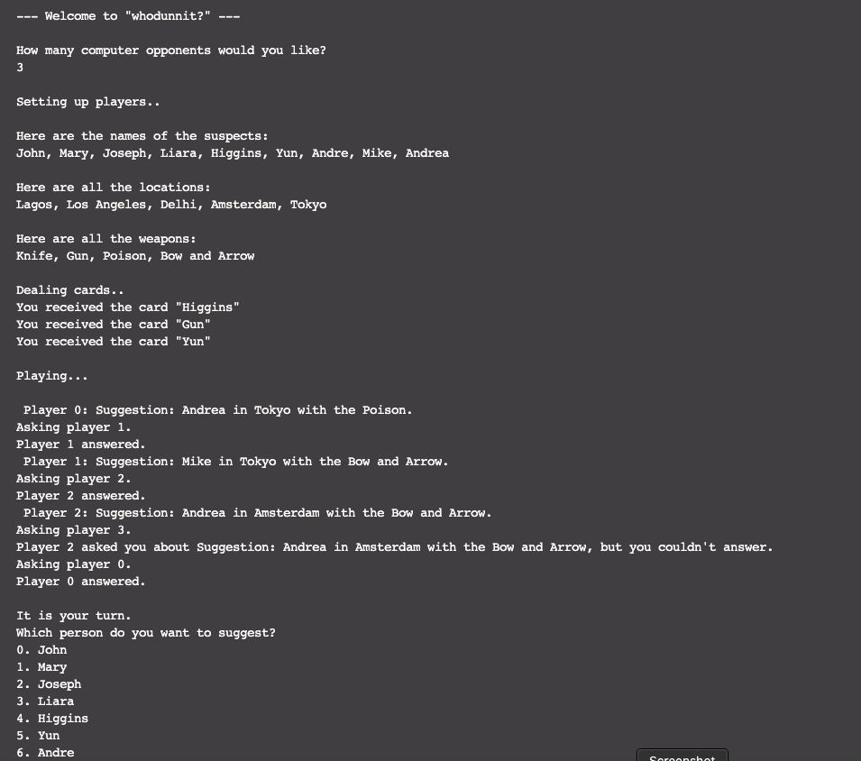

# WhoDunnit  

A simple command line game written in Ruby.

## Game Description  

"whodunit?" is simpler than Clue. Most notably, there will not be a game board or dice in "whodunit?", so there is no movement in the game. Additionally, the players do not take on character identities in the game – players and suspects are separate in "whodunit?". The game will thus consist of players taking turns making guesses about the identity of the murderer, the weapon and the location of the murder. The first person to guess correctly wins the game. Also in "whodunit?", a turn consists of either a suggestion and an accusation (not both).  

## How to run the game  

Type the following command into the terminal, once you are inside the src folder.  
> ruby Main.rb  

Note: make sure you have the Ruby interpreter installed on your computer.  

## Screenshot  

